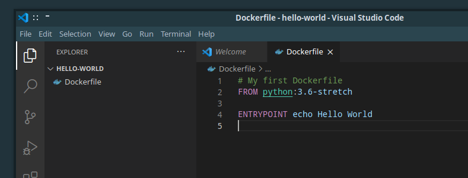
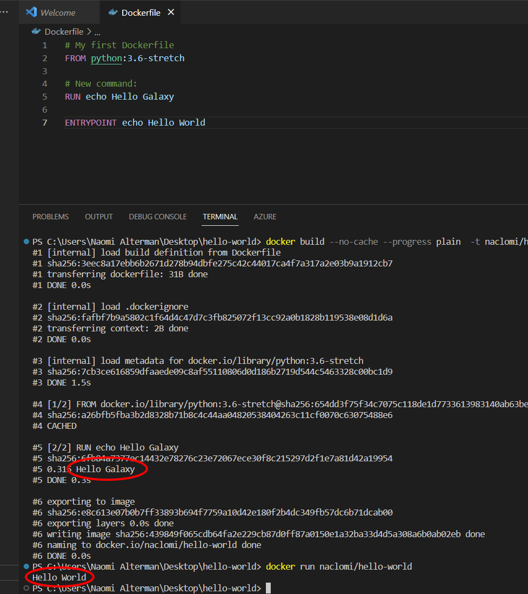
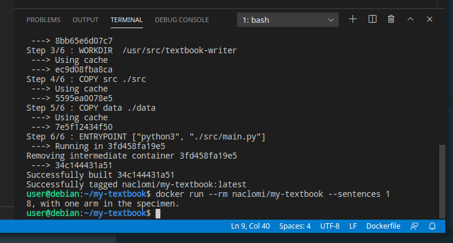

# Part 2: Building containers

Running docker containers in itself is a useful skill and you can do a lot with the pre-existing containers published on Docker Hub, but to fully customize the contents of a container you'll need to build your own images. In this section we'll walk through how.

#### Building our first image

Images are defined through a **Dockerfile**, a little script that instructs Docker which files to copy into the container and what the entrypoint command is to be executed once the container is eventually run. Once we write our Dockerfile, we'll issue a terminal command that reads it in and actually builds the container image. Once *that's* done, we'll be able to run the container like we did in the previous section.

To get started, create a folder somewhere on your computer called `hello-world`. We'll be storing source code for our container image there. Next, open it in VSCode through the Explorer sidebar tab's "Open Folder" button:


If you already had a folder or project open, you may need to close it by navigating to `File menu -> Close Folder`.

Once you've opened the `hello-world` folder, create a new file (`File menu -> New File` or `Ctrl+N`) and fill it with the following contents:

```dockerfile
# My first Dockerfile
FROM python:3.6-stretch

ENTRYPOINT echo Hello World
```

Save the file with `File menu -> Save` or `Ctrl+S` and name it `Dockerfile`. At this point, you should see the text become **syntax highlighted** and the file appear in the Explorer sidebar on the left:



Now open a terminal (`Terminal menu -> New Terminal`) and run the command:

`docker build -t [DOCKERHUB-USERNAME]/hello-world .`

replacing `[DOCKERHUB-USERNAME]` with the username you used to sign up for Dockerhub. Make sure to include the period `.` a the end of the command :) !

The first time you run this command might take a few minutes to download all of the files required to build the container (it'll go faster next time!). Once it's done you should see output that ends with a message like this:

```
Successfully built 7856838c829b
Successfully tagged naclomi/hello-world:latest
```

Now, we can run our container either from the Docker sidebar or with the following terminal command:

```
docker run --rm [DOCKERHUB-USERNAME]/hello-world 
```


You did it! You just built your first container image! So....what exactly did you just do? Let's start by walking through the dockerfile code you wrote.

#### Dockerfile Syntax

A dockerfile consists of a series of commands, one per line. Comments start with a `#`, after which the rest of the line is ignored (just like Python). 

Our first command was **FROM**:

- `FROM [image-name]`
  This bases our new image off the **base image** specified by `[image-name]`, on top of which our changes get layered like new layers of paint on a painting. That name might refer to an image you already have on your computer, or possibly an image published on Docker Hub. Either way, all dockerfiles must start with a FROM command.

  In this case our base image was `python:3.6-stretch`, a container that already comes with Linux and Python 3.6 pre-installed. If we wanted to base an image off the latest version of Ubuntu Linux, it might look something like this: `FROM ubuntu:latest`.

Then, we issued an **ENTRYPOINT** command:

- `ENTRYPOINT [terminal-command]`
  This sets what command will be executed when the container image is actually run with `docker run`. Only the last ENTRYPOINT command in the Dockerfile will actually take effect, while the rest will be ignored.

  In this case, we issue the command `echo Hello World`, which prints "Hello World" to the terminal. Any command you normally type into the terminal could be put here, though keep in mind that command will only have access to what your Dockerfile copies into the container.

#### The `build` command and image tags

To build a container, we run the `docker build` command which takes the form:

`docker build -t [image-name] [project-directory]`

The `-t [image-name]` flag specifies what we want to call, or **tag**, the image. We can actually specify as many tags as we like, by repeating the `-t [image-name]` flag with new names. By convention, names take the form:

`[user-name]/[image-name]:[image-version]`

where `[user-name]` is your Dockerhub username, `image-name` is what you'd like to call the image, and `[image-version]` is a version number like `1.0` or `latest` (the default version). If you leave out the `:[image-version]` section of the name, Docker will just assume the version is `latest`.

Finally, `[project-directory]` specifies the folder on your computer that contains the `Dockerfile` you would like to compile. In this case, since our terminal was already in the project directory, we just specified "the current location" with `.` .

#### Build-time versus run-time

Let's add a new command to our Dockerfile:

```dockerfile
# My first Dockerfile
FROM python:3.6-stretch

# New command:
RUN echo Hello Galaxy

ENTRYPOINT echo Hello World

```

Save the file and re-run the `docker build` command from the previous exercise (recall you can use the up arrow key in the terminal to retrieve previous terminal commands you've run). In general, you need to run `docker build` every time you modify the Dockerfile for your changes to actually take effect.

Once it's built, re-run the container with `docker run`.

Let's look at the output for all of this:

```
user@debian:~/hello-world$ docker build -t naclomi/hello-world .
Sending build context to Docker daemon  2.048kB
Step 1/3 : FROM python:3.6-stretch
 ---> d8e3ac20e6dd
Step 2/3 : RUN echo Hello Galaxy
 ---> Running in 83cf57ff4447
Hello Galaxy
Removing intermediate container 83cf57ff4447
 ---> c1c2c5086c1f
Step 3/3 : ENTRYPOINT echo Hello World
 ---> Running in b6fb35bc5148
Removing intermediate container b6fb35bc5148
 ---> 26a6f4c65850
Successfully built 26a6f4c65850
Successfully tagged naclomi/hello-world:latest
user@debian:~/hello-world$ docker run naclomi/hello-world 
Hello World
user@debian:~/hello-world$ 
```



Gosh! Let's call attention to the place where our two `echo` messages showed up. The `echo` issued by the `RUN` command happened when we ran `docker build`, while the `echo` issued by `ENTRYPOINT` happened when we ran `docker run`.

This is a really important concept:

**RUN commands happen at "build time", while the ENTRYPOINT command happens at "run time"**

In practice, this means the `RUN` commands only happen once when you build the container image, and then the `ENTRYPOINT` will happen every time any user out there in the wide world runs the image. This division of build time and run time is useful because it allows us to issue terminal commands that install software once at build time, and then never have to worry about them again.

Taking a step back, the best way to think about a Docker container might be as a fish tank: 

*(Photo by [Sarah Brown](https://unsplash.com/@sweetpagesco?utm_source=unsplash&utm_medium=referral&utm_content=creditCopyText) on Unsplash)*

The Dockerfile is the instruction manual telling you how to assemble the tank. At build-time, you follow the instructions to pour rocks into the bottom of the tank and set up all of the tank's decorations. Then, at run time, you fill the tank with water and introduce the fish. The `RUN` commands specify how and where to put the tank decorations. The `ENTRYPOINT` command specifies what fish we will eventually put in the tank. The `docker run` terminal command actually pours the water and introduces the fish.

#### Building a container with files

Let's start work on our textbook-writer image. Create a new folder on your computer somewhere other than within `hello-world`. Call the new folder `my-textbook`. Open the folder in VS Code, create a new empty file, and save it in the directory as `Dockerfile`. 

Then, download the source code and data for the textbook writer here and unzip it to the same location as the Dockerfile:

https://drive.google.com/file/d/1tXHQtgXaId9oizIN3aw1ACgHxqLurXkA/view?usp=sharing

At this point, your project directory should have the following structure:


Make sure your files are arranged this way before your proceed.

Next, let's put some code in our Dockerfile:

```dockerfile
FROM python:3.6-stretch

WORKDIR  /usr/src/textbook-writer
COPY src ./src
COPY data ./data

ENTRYPOINT python3 ./src/main.py
```

We've got a few new commands going on here. Let's take a closer look at them:

- **COPY**
  `COPY [source-file-or-folder][destination-file-or-folder]`
  At build-time, copies a file (or folder full of files), from your computer into the container.

  Note that the source path is relative to the directory structure  on your computer, while the destination path is relative to the directory structure in the container. We're going from one parallel universe to another.

  So, the way to read the first `COPY` command in our code is:
  "Take the `src` folder on my computer next to my `Dockerfile` (that's the one you just unzipped), and copy it into the container to the location `./src`".

  But the `.` in the destination path means "starting from the current directory". How do we know where in the container we're starting from? That's what the next command is for.

- **WORKDIR**
  `WORKDIR [container-path]`
  This sets the "working directory" that all future Dockerfile commands will operate from. It's like when we run `cd` from our terminal, but for Dockerfile commands instead of terminal commands. The path you specify refers to files inside the container, not on the rest of your computer.

So, our script sets the container's working directory to `/usr/src/textbook-writer`, copies the source and data directories we just unzipped into it, and then sets the entrypoint to be the python script we just `COPY`ed in.

Ohkay! Build and run the container!

And if all goes well, you should get........

```
user@debian:~/my-textbook$ docker run --rm naclomi/my-textbook
Traceback (most recent call last):
  File "./src/main.py", line 4, in <module>
    import markovify
ModuleNotFoundError: No module named 'markovify'
user@debian:~/my-textbook$ 
```

This error. Like, very specifically this error (if you get another error, ask your TA for help).

What's going on here?

#### Installing dependencies

A quick google for "markovify" turns up this:

https://pypi.org/project/markovify/

It looks like "markovify" is a Python library used for generating gibberish text. Our script **depends** on this library! Thank you for your beautiful work library authors!

We'll add a command to our Dockerfile to install this library at build time, so that nobody else has to worry about this software dependency ever again. Modify your Dockerfile to include the following RUN command:

```dockerfile
FROM python:3.6-stretch

# New line of code:
RUN pip3 install markovify

WORKDIR  /usr/src/textbook-writer
COPY src ./src
COPY data ./data

ENTRYPOINT python3 ./src/main.py
```

Recall that `RUN` executes a terminal command inside of the container at build time. The command in this case, `pip3 install markovify`, asks the Python package manager ("pip") to download and install the `markovify` library for us (all inside the container). That command is the same kind of thing you could run from your terminal without docker.

Now rebuild the image and rerun the container. You should get some quality garbage output:


Hooray! But what if we want only one sentence of output? We can just pass it as a command line argument, right?

```
docker run --rm naclomi/my-textbook --sentences 1
```


......hmm. That looks like.....it didn't work.

#### Taking command-line arguments

To get our container to accept command line arguments, we're going to have to make a small change to the way we use the `ENTRYPOINT` command. It turns out, the command has two forms. Here's the one we used:

```dockerfile
ENTRYPOINT python3 ./src/main.py
```

This is called **shell form**, because it's how we enter commands in our own terminal shell. Here is the other form:

```dockerfile
ENTRYPOINT ["python3", "./src/main.py"]
```

This is called **exec form**. Instead of typing the command out normally, we surround it with square brackets (`[]`) and surround each flag with double-quotes `""`, separating them with commas. Basically, take your shell form, separate the text into words based on the spaces, surround each word with quotes, and put them in `[]`s.

Docker containers will only pass command line arguments to the entrypoint if it is specified in exec form. So let's update our dockerfile:

```dockerfile
FROM python:3.6-stretch

RUN pip3 install markovify

WORKDIR  /usr/src/textbook-writer
COPY src ./src
COPY data ./data

ENTRYPOINT ["python3", "./src/main.py"]
```

Rebuild and rerun:



Muuuuuch better. Our command line flag asking for only one sentence now successfully makes it to the python script.

#### Default arguments

We can actually specify default flags to be passed to the entrypoint, that disappear if the user specifies their own when they run the container. To do that, we use the **CMD** command:

`CMD ["flag1", "flag2", ...]`

At run-time, the `CMD` command will glue whatever flags you specify in its list to the end of the list of flags used by `ENTRYPOINT` unless the user specifies their own command-line flags, in which case it will do nothing. Similar to `ENTRYPOINT`, only the last `CMD` in your Dockerfile will actually take effect. And similar to user-supplied command line flags, `ENTRYPOINT` has to be in exec form for `CMD` to do anything.

So! If we wanted to by default generate 4 sentences of text, unless the user specified otherwise, we could write a Dockerfile like this:

```dockerfile
FROM python:3.6-stretch

RUN pip3 install markovify

WORKDIR  /usr/src/textbook-writer
COPY src ./src
COPY data ./data

ENTRYPOINT ["python3", "./src/main.py"]
CMD ["--sentences", "4"]
```


Not a necessary feature by any means, but potentially useful.

**Stretch challenge #1**

Replace the source text that the generator script trains off of with your own content, to create a text generator for something other than a matsci textbook :)

#### Stretch challenge #2

If you try generating a PDF as you did in the "Running containers" portion of this tutorial, you'll find that your container still doesn't fully work. It's missing the programs our script uses to save PDF files: `ghostscript` and `enscript`.

To install them, you'll need to add a command to the right place in your Dockerfile that uses the Linux package manager `apt-get` . See if you can get it working.

*Hint: the first thing you'll have to do is run the command `apt-get update`* 

