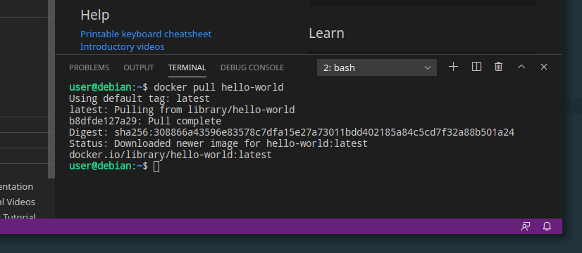
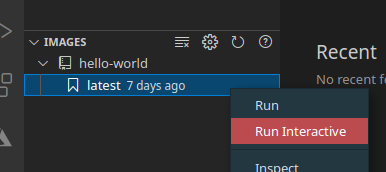
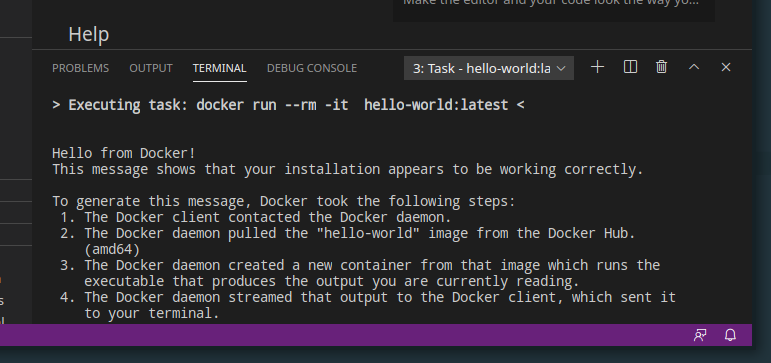
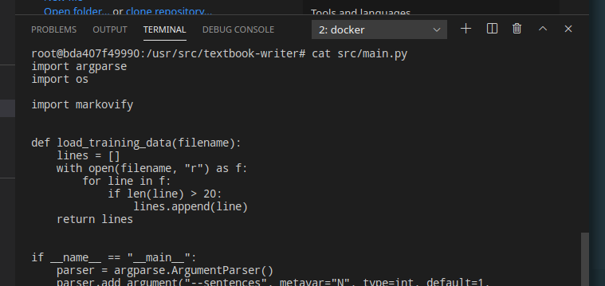
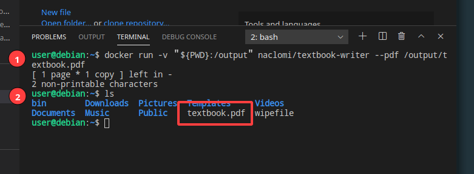
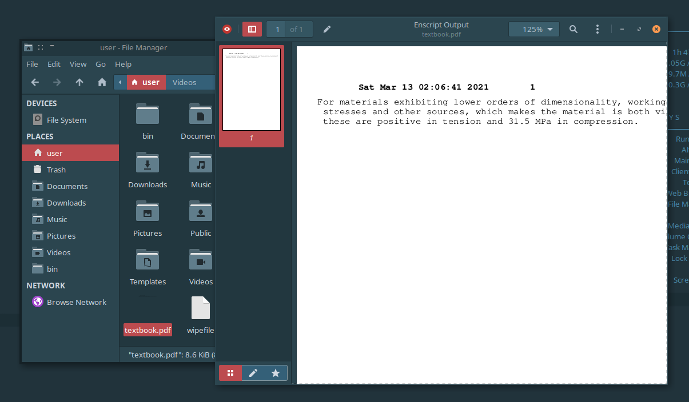

## Pulling our first image

First things first, let's open a **terminal** in VS Code that we'll issue Docker CLI commands from.

Select `Terminal -> New Terminal`


Now, in the terminal that pops up in the bottom of our VS Code window, enter the following command:

```bash
docker pull hello-world
```



The **pull** command has the syntax `docker pull [IMAGE NAME]` and downloads the specified image hosted on Docker Hub to your computer. In this case, we're pulling a very simple container image that will print a Hello World message to our terminal when we run it.

We should now see `hello-world` in the list of docker images installed on our system. We can see all of the images we have installed by clicking the Docker icon on the left-side of the VS Code window (1) and then inspecting the list in the `IMAGES` accordion box. See how the image we just pulled appears there (2):


If we click the arrow to the left of the image name to expand it, we'll see a **version list**. If we download multiple versions of the container (like multiple editions of a book), they will all be listed here, but for now we only have the **latest** version:


## Running our first container, through VS Code

Anyway, now that we've downloaded `hello-world`, let's run it. One way to do so is by right-clicking an image version in the `IMAGES` list  and selecting `Run interactive`:



We'll see the results of the run appear in the terminal part of the window:



Congratulations, you just ran your first container!

**So, what just happened?**

If containers are like little VMs, what happened to this one? Does it still exist? How did it print this text? Is it bored? Is it lonely?

When we **run** a container, the contents of the image are copied from disk into memory, and then the container's **entrypoint** is executed. The entrypoint is a terminal command, just like the ones we enter into the VS Code terminal. The only difference is that the command is executed from within the virtual world of the container, and it's specified ahead of time when the image was built. In this case, the entrypoint was a command that printed the "Hello from Docker!" message we see above.

After the entrypoint command completes, the container is **shut down** and its memory is freed. This means that all of the **changes to container files get wiped**; every time we run the container, it starts again from same the pristine state the image specifies.

## Running our first container, through the CLI

Notice that when we ran the container, the output started with the message: 

`> Executing task: docker run --rm -it  hello-world:latest <`

This is actually displaying the CLI command that we could enter into the terminal to run the container. It's really nice that the graphical interface tells us its equivalent CLI commands like this!

The docker **run** command takes this form:

```bash
docker run [flags] [image name]:[image version]
```

As we saw earlier, the image name is `hello-world`, and the version we downloaded was `latest` (this is the default version name, and if we didn't specify a version `latest` would be implied).

The `--rm` flag tells docker to delete the leftover contents of the container once it finishes running. Note that this doesn't delete the image -- it deletes the container we just ran, which was reconstituted from the image.

The `-it` flags tell docker to run the container interactively -- that is, use the terminal to print output and take input from us. Omitting this flag would run the container in the background without giving us an opportunity to prod it from the terminal. This is useful for containers that run web servers or train machine learning models, applications that might take a long time and not need user interactivity (at least, not interactivity through the terminal)

Let's try running the container again through the terminal. As the message says, press any key in the terminal to return to an interactive prompt. Now run the command:

```bash
docker run --rm -it  hello-world
```

We should see the same output as before:


Using the GUI to run containers is fast and easy, but using the CLI will give us some much-needed flexibility later on.

## Trying out a more interesting container

Now that we've gotten our sea legs, let's try running a container that does something more interesting. The `naclomi/textbook-writer` image contains a python script that uses rudimentary AI techniques to write machine-generated nonsense paragraphs for a materials science textbook. Here's a link to the container's page on Docker Hub:

[https://hub.docker.com/r/naclomi/textbook-writer](https://hub.docker.com/r/naclomi/textbook-writer)

{}

 **🏆 EXERCISE:** Use the commands we explored above to pull the image and then run it interactively. If you need reminders of the commands you've previously run, try using the **up and down arrow keys** at the terminal prompt to scroll through your command history.

Once you do so successfully, you should see some scientific-sounding garbage text printed to the console, looking something like this:


{}
  

## Exploring the internals

Let's next explore the virtual world of the textbook-writer's container, to get a sense of how it works. To do this we will explicitly change the entrypoint of the container from `main.py` (the textbook generation script) to `bash` (the **shell** program that lets us enter terminal commands). This deviates from the default usage pattern designed by author of the container image; we're effectively using a master key to climb into the container as the root user for a look around. The author will probably forgive us our curiosity ;) .

We can open a bash shell inside the container with the following command:

```bash
docker run --rm -it --entrypoint bash naclomi/textbook-writer
```


Notice how the prompt has changed: we are now in a terminal within the container's virtual world, where our username is `root`, and the computer's name is `bda407f49990` (or some other arbitrary-looking name), and the current directory is `/usr/src/textbook-writer`. 

Let's take a look around. Run the `tree` command print the files within the current directory:


Cool! We can see here that the non-gibberish real textbook that the machine-generated passages are based on is in the `data/` directory, and the entrypoint script is at `src/main.py`. Let's try running it from here:

```bash
python3 src/main.py
```


And now let's look at the source code, by using the `cat` command to print the file to the terminal:

```bash
cat src/main.py
```



Neato.

We can see that the script uses the library [markovify](https://pypi.org/project/markovify/) to generate random text. We didn't need to install this library ahead of time, because it came packaged inside the script's container. This is one of the main benefits of containeriazation!

To exit the virtual terminal, run the command `exit` or use the keyboard shortcut `Ctrl+D`

## Entrypoint flags

If in the container we ran `python3 src/main.py -h`, we'd see that the python script takes some command line arguments of its own:

```bash
usage: main.py [-h] [--sentences N] [--pdf FILENAME]

optional arguments:
  -h, --help      show this help message and exit
  --sentences N   how many sentences to output
  --pdf FILENAME  output as a pdf file
```

Since `main.py` is the container's entrypoint, any flags we put in our `docker run` command following the image name will be passed to it.  Let's try playing with them. From the terminal:

```bash
docker run --rm -it naclomi/textbook-writer --sentences 1 
```


We can use the `--pdf` flag to output the text as a pdf file, rather than terminal text:

```bash
docker run naclomi/textbook-writer --pdf textbook.pdf
```


...but, how do we get the file *out* of the container?

## File mounts

By default, when a container finishes running all of the files generated or modified during its run are lost. However, we can **mount a directory** from our computer into the container's file system, inside of which any files created or modified will **persist** after the container shuts down.

Think of a file mount like a backpack: you can bring all of your study materials to the library, unpack them onto a table, and then do work. When you leave, you put everything back in your bag to carry out of the library, while at night anything you left on the table will get thrown out by the custodial staff.

To mount a directory to a container, we specify the mount point as a flag in our `docker run` command. The flag takes this form:

```bash
-v [host_path]:[container_path]
``` 

where `[host_path]` is the directory on your computer to mount, and `[container_path]` is the place inside the container it will show up. 

For our textbook writer, we can mount the current directory the terminal is sitting in to the container path `/output` with this command line (1):

```bash
docker run -v "${PWD}:/output" naclomi/textbook-writer --pdf /output/textbook.pdf
``` 



Then, if we look at the contents of the current directory (2), we'll see that the container saved the pdf to our working directory :D ! Let's open it up!

Still just as incomprehensible as ever ;) .
